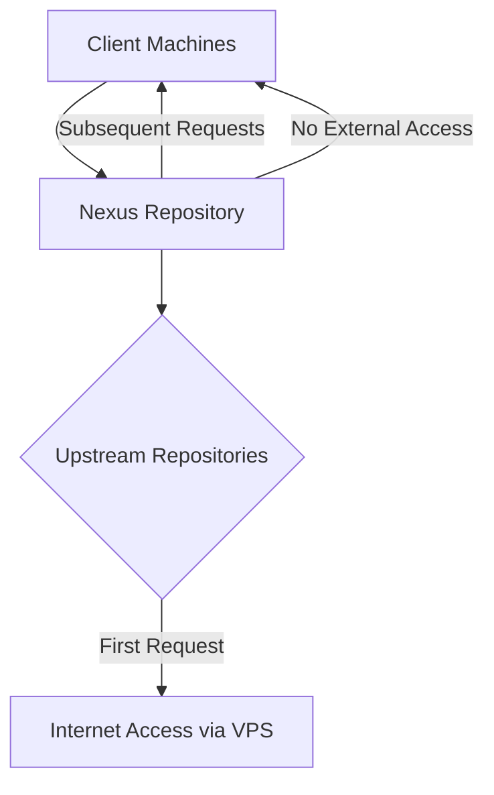

# Comprehensive Bypass Solution for Package & Container Restrictions  
## Using Nexus Repository Manager

This solution creates a self-sustaining package ecosystem that bypasses external restrictions for:

- **APT** (Debian/Ubuntu)  
- **YUM** (CentOS/RHEL)  
- **Docker**  
- **Kubernetes** (`kubeadm`, `kubelet`, `kubectl`)  

---

### ⭐ Core Architecture

Key Principle: Only the Nexus server requires initial internet access. Clients only communicate with Nexus.

